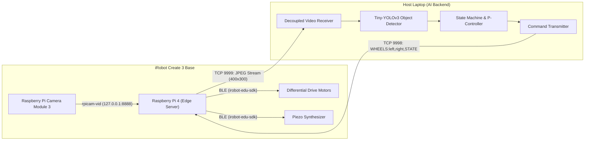

# Autonomous iRobot Create 3: Distributed Edge-AI Vision & Tracking System

> Real-time object tracking, person following, and warehouse inventory scanning using an iRobot Create 3, Raspberry Pi 4, and distributed Tiny-YOLOv3 edge computing.

[](https://www.python.org/)
[](https://edu.irobot.com/what-we-offer/create3)
[](https://opensource.org/licenses/MIT)
[](https://www.hs-mainz.de/)

---

## Demo

### Companion Bot (Person Following)
[](PLACEHOLDER_YOUTUBE_LINK_1)

### Interactive Object Hunter
[](PLACEHOLDER_YOUTUBE_LINK_2)

### AI Warehouse Inspector (360° Inventory Scan)
[](PLACEHOLDER_YOUTUBE_LINK_3)

---

## Overview

This project implements a distributed autonomous robotics system coupling an iRobot Create 3 platform with edge deep learning computer vision. By offloading computational workloads from an onboard Raspberry Pi 4 to a host laptop backend over dedicated, low-latency TCP sockets, the system achieves real-time visual tracking, state-machine-driven human following, and automated spatial inventory scanning without sacrificing mobility or responsiveness. Developed as a 3-person team project for the *Angewandte Robotik* (Applied Robotics) module at Hochschule Mainz, this repository represents my individual developer portfolio showcase of the complete hardware and software codebase.

---

## Photos


*Raspberry Pi 4 + Camera Module 3 mounted on the Create 3 chassis powered by an external USB-C power bank.*


*Real-time Tiny-YOLOv3 detection stream running on the laptop backend with bounding boxes, confidence scores, and tracking telemetry.*


*AI Warehouse Inspector UI displaying the 360° rotation progress bar, active bounding boxes, and real-time itemized inventory counts.*


*OpenCV computer vision pipeline: HSV color thresholding, morphological filtering, and contour localization for autonomous ball tracking.*

---

## Key Features

- **Decoupled Client-Server Edge Architecture**: Offloads Tiny-YOLOv3 inference to a remote workstation over dual TCP streams, leaving the onboard Raspberry Pi lightweight and responsive.
- **Manual & Autonomous Driving Modes**: Direct WASD teleoperation via `pynput` as well as autonomous geometric patrol routines with instantaneous asynchronous bumper collision interrupts.
- **Wireless Robot Control via Bluetooth**: Native BLE integration through `irobot-edu-sdk` and `bluetoothctl` featuring synchronized status LEDs and auditory state cues.
- **Classical Computer Vision Tracking (OpenCV)**: HSV color thresholding, morphological erosion/dilation, and contour circle approximation for dual-behavior tracking (following blue targets, evading red targets) with an embedded HTTP live stream.
- **Companion Bot (Human Following AI)**: Human detection using aspect-ratio bounding-box heuristics ($height > 1.3 \times width$) to isolate standing pedestrians from seated persons, managed by a 3-state finite state machine (`TRACKING` / `SEARCHING` / `IDLE`) with proportional visual servoing and distance braking.
- **Interactive Object Hunter**: Terminal-based target selection across 80 COCO classes; enables the robot to scan the environment, center on the selected target with closed-loop steering, and emit distinct audio chimes upon acquisition.
- **Automated Warehouse Inventory Scanner**: Autonomous timed 360° rotational scan with class-agnostic object detection, cooldown-based de-duplication to prevent duplicate entries, live HUD inventory overlay, and acoustic alerts on newly discovered classes.

---

## System Architecture

The system uses a distributed client-server architecture split between the onboard **Raspberry Pi 4** (Edge Hardware Server) and a **Host Laptop** (AI & Control Client):

1. **Edge Server (Raspberry Pi 4)**:
   - Reads the local camera feed via `rpicam-vid` (MJPEG over `tcp://127.0.0.1:8888`).
   - Downsamples frames to $400 \times 300$, applies JPEG compression (quality 70), packs an 8-byte 64-bit frame-length header (`struct.pack("Q", len)`), and streams video over **TCP Port 9999**.
   - Listens on **TCP Port 9998** for incoming velocity commands and translates them directly to the Create 3 via Bluetooth using the `irobot-edu-sdk`.
2. **AI Backend (Laptop)**:
   - Receives and decodes the MJPEG stream inside a decoupled background thread to eliminate TCP frame buffering.
   - Executes Tiny-YOLOv3 inference (via ImageAI) on the latest available frame.
   - Evaluates target coordinates using a Proportional (P) controller and state machine logic.
   - Sends real-time motion and audio payloads back to the Pi over **TCP Port 9998**.

### Communication Protocol

Control commands are transmitted over TCP Port 9998 as plain-text ASCII strings using the following protocol:

```text
WHEELS:left_speed,right_speed[,STATE]
```

- `left_speed`, `right_speed`: Target wheel velocities in cm/s (e.g. `WHEELS:-2.5,2.5` or `WHEELS:8.0,8.0`).
- `STATE` *(optional)*: System state flag (`NONE`, `TRACKING`, `FOUND`, `REACHED`). Signals like `FOUND` trigger non-blocking, asynchronous acoustic chords (e.g., G5 / C6 or F#5) on the robot's onboard synthesizer without interrupting motor execution.
- **Fail-Safe Mechanism**: Any dropped socket connection or unparseable packet immediately halts wheel motion (`WHEELS:0.0,0.0`).

### Data Flow Diagram



---

## Repository Structure

```text
.
├── pi/
│   ├── challenge2_1.py              # Manual keyboard teleoperation (WASD) using pynput
│   ├── challenge2_2.py              # Autonomous square-driving routine with async bumper collision interrupt
│   ├── challenge4.py                # BLE Create 3 control from Pi with synchronized dual-color LED status indicators
│   ├── challenge5_ph1.py            # Phase 1: Video pipeline validation and single-frame capture
│   ├── challenge5_ph2.py            # Phase 2: Color space transformation from BGR to HSV
│   ├── challenge5_ph3.py            # Phase 3: HSV color masking and morphological cleanup (erosion & dilation)
│   ├── challenge5_ph4.py            # Phase 4: Contour detection and minimum enclosing circle localization
│   ├── challenge5_ph5.py            # Phase 5: Autonomous ball tracking (follow blue / evade red) with browser HTTP stream
│   ├── Personenerkennung.py          # Distributed edge server: TCP video stream (9999) & command processor (9998)
│   ├── challenge6_pi_objects.py      # Edge server variant with acoustic chime feedback for object hunting
│   └── warehouse_inspector_pi.py     # Edge server variant with non-blocking audio alerts for 360° warehouse scanning
└── laptop/
    ├── challenge6_laptop_personenerkennung-2.py  # AI backend for Companion Bot: standing-person detection & state tracking
    ├── challenge6_laptop_objects.py              # AI backend for Object Hunter: interactive CLI selector & visual servoing
    └── challenge6_laptop_warehouse_inspector-3.py # AI backend for Warehouse Inspector: 360° scan, inventory de-duplication & HUD
```

---

## Getting Started / Requirements

### Hardware Requirements

- **Mobile Robot Base**: iRobot Create 3
- **Edge Microcomputer**: Raspberry Pi 4 Model B (Raspberry Pi OS 64-bit recommended)
- **Vision Sensor**: Raspberry Pi Camera Module 3
- **Compute Backend**: Host laptop or desktop with Wi-Fi
- **Power**: Portable USB-C Power Bank (5V/3A output) for the Raspberry Pi
- **Network**: Shared local Wi-Fi network or mobile hotspot connecting Pi and Laptop

### Software Prerequisites

- Python 3.9+ installed on both Raspberry Pi and Laptop
- Linux BlueZ stack with `bluetoothctl` configured on the Raspberry Pi
- Pre-trained Tiny-YOLOv3 weights file: [`tiny-yolov3.pt`](https://github.com/OlafenwaMoses/ImageAI/releases/download/3.0.0-pretrained/tiny-yolov3.pt) placed in the `laptop/` folder

### Raspberry Pi Environment Setup

```bash
# Clone the repository and navigate to the pi folder
cd pi

# Create and activate virtual environment
python3 -m venv env
source env/bin/activate

# Upgrade pip and install dependencies
pip install --upgrade pip
pip install irobot-edu-sdk pynput opencv-python-headless numpy
```

### Laptop Environment Setup

```bash
# Navigate to the laptop directory
cd laptop

# Create and activate virtual environment
python3 -m venv env
source env/bin/activate   # On Windows: .\env\Scripts\activate

# Upgrade pip and install dependencies
pip install --upgrade pip
pip install opencv-python numpy imageai

# Ensure tiny-yolov3.pt weights file is located in the working directory
```

---

## Usage

Before launching any vision-based script, start the camera MJPEG stream on the Raspberry Pi:

```bash
rpicam-vid -t 0 --inline --width 640 --height 480 --codec mjpeg --listen -o tcp://127.0.0.1:8888
```

> **Note**: In each laptop script, verify that `PI_IP_ADDRESS` matches the current IP address of your Raspberry Pi on the shared network.

### Scenario A: Companion Bot (Person Following)

Follows a standing individual, centers the target horizontally via proportional turning, maintains following distance, and enters search/idle states when target is lost.

```bash
# Terminal 1 (Pi): Start edge server
cd ~/pi && source env/bin/activate
python Personenerkennung.py
```

```bash
# Terminal 2 (Laptop): Start AI backend
cd laptop && source env/bin/activate
python challenge6_laptop_personenerkennung-2.py
```

### Scenario B: Interactive Object Hunter

Presents an interactive terminal menu of 80 COCO classes. Once selected, the robot autonomously searches the environment, centers on the object, and chimes when acquired.

```bash
# Terminal 1 (Pi): Start edge server
cd ~/pi && source env/bin/activate
python challenge6_pi_objects.py
```

```bash
# Terminal 2 (Laptop): Start AI backend
cd laptop && source env/bin/activate
python challenge6_laptop_objects.py
```

### Scenario C: AI Warehouse Inspector (360° Inventory Scan)

Executes an automated, timed 360° continuous rotation while identifying all visible objects, cataloging items with cooldown de-duplication, and rendering real-time inventory counts on the HUD.

```bash
# Terminal 1 (Pi): Start edge server
cd ~/pi && source env/bin/activate
python warehouse_inspector_pi.py
```

```bash
# Terminal 2 (Laptop): Start AI backend
cd laptop && source env/bin/activate
python challenge6_laptop_warehouse_inspector-3.py
```

---

## Engineering Challenges & Solutions

| Technical Challenge | Root Cause | Implemented Solution |
| :--- | :--- | :--- |
| **Network Buffer & Video Latency Lag** | Sequential camera reading caused TCP socket buffer buildup; inference processed stale, seconds-old frames, creating severe control lag and overshoot. | Implemented a dedicated background reader thread (`camera_reader_thread`) that continuously flushes internal buffers and stores strictly the latest frame into a shared global variable for immediate consumption. |
| **Control Oscillation & Kinematic Jitter** | High-gain angular correction caused the robot to aggressively oscillate across the optical center line ($\Delta x = 0$) during visual servoing. | Calibrated a Proportional (P) controller ($v_{\text{turn}} = K_p \cdot |\Delta x|$) with tuned gain ($K_p = 0.012$), velocity clamping ($0.5 \le v \le 4.0\text{ cm/s}$), and an expanded central deadband ($\pm 45\text{ px}$) to provide smooth, jitter-free convergence. |
| **Wi-Fi Bandwidth Saturation** | Streaming uncompressed $640 \times 480$ raw BGR frames over ad-hoc Wi-Fi caused packet drops, high latency spikes, and socket disconnects. | Downsampled frames to $400 \times 300$ on the Pi, applied hardware-efficient OpenCV JPEG compression (`quality=70`), and capped output at $\approx 20\text{--}30\text{ FPS}$, preserving detection accuracy while slashing network throughput. |

---

## Tech Stack

- **Core Language**: Python 3
- **Computer Vision & Deep Learning**: OpenCV (`opencv-python`, `opencv-python-headless`), ImageAI, Tiny-YOLOv3 (PyTorch backend, COCO dataset)
- **Robotics & Teleoperation**: `irobot-edu-sdk`, BlueZ / `bluetoothctl`, `pynput`
- **Networking & Concurrency**: TCP Sockets (`socket`, `struct`), Multi-threading (`threading`), Asynchronous I/O (`asyncio`)
- **Hardware Platforms**: iRobot Create 3, Raspberry Pi 4 (Raspberry Pi OS 64-bit), Raspberry Pi Camera Module 3

---

## Team & Credits

This project was engineered as part of the *Angewandte Robotik* (Applied Robotics) module at **Hochschule Mainz**.

- **Alex Brinckmann** — Developer & Portfolio Showcase Author
- **Lukas L.** — Team Partner
- **Luca W.** — Team Partner

---

## License

This project is licensed under the MIT License. See `LICENSE` for details.

<!-- TODO: confirm license -->
